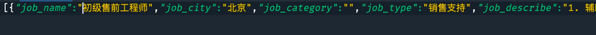

# DEMO

## 介绍

```
用于爬取校招相关数据并生成job.json文件
```
---
## 运行

### 方式一（有go运行环境下）
```
go run main.go
```
### 方式二（无go运行环境下）
```
./demo
```
---
## 运行结果 同时生成job.json文件
```
2022/03/04 05:46:06 生成json文件成功！
```


---
## 单元测试
```
go test main_test.go main.go  -v 
```
